# 서비스 ~ 인그레스

# Kubernetes

하위 문서 정리

https://kubernetes.io/ko/docs/concepts/services-networking/service/

https://kubernetes.io/ko/docs/concepts/services-networking/ingress/

https://kubernetes.io/ko/docs/tasks/access-application-cluster/ingress-minikube/

## 서비스

> 외부와 접하는 단일 엔드 포인트를 제공한다
이 엔드포인트는 여러 개의 백엔드(Pod) 뒤의 애플리케이션을 연결해주는 역할을 한다.
> 
- 쿠버네티스 사용으로 유저는 ‘서비스 디스커버리 메커니즘’ 사용을 위해 애플리케이션을 수정할 필요가 없다.
- 쿠버네티스가 파드에게 고유한 IP주소와 파드집합에 대한 DNS 명을 부여하므로, 서비스 뒷단의 여러 Pod들 간 로드밸런싱이 가능해진다.

 동기 : 

> 쿠버네티스의 Pod은 언제든지 바뀔 수 있는 임시존재이다.
→Desired state와 일치하도록 생성과 삭제를 반복하므로 → ip 주소가 변동
> 

이때 프론트엔드 앱(pod)이 백엔드 앱(pod)에 접속하려고 하면,

백엔드의 IP 주소가 계속 바뀔 수 있는데,  이걸 어떻게 추적해야하는가?

⇒ 때문에, 고정적인 주소 역할을 위해 Service 등장

<aside>
💡

서비스를 조사하다 궁금해진 부분
서비스를 다수의 노드에 적용하려면,
동일 서비스를 여러 개 생성하는 개념인지, 단일 서비스가 여러 개의 노드에 연결되는 개념인가?
답은…..
→ Service는 하나만 만들면 된다…! , 모든 워커 노드의 NodePort에 똑같은 포트 번호로 연결을 뚫어준다. 

</aside>

### 서비스 리소스

**서비스**

- 여러 개의 pod를 하나처럼 묶어주는 논리적 주소이자 이들에게 접근할 수 있는 정책(policy)을 정의하는 **추상적 개념**
- 서비스의 target 파드 집합 → 셀렉터가 결정

ex) 백엔드 pod이 3개가 있고, 다 같은 작업을 처리한다면, 프론트엔드가 어느 pod에게 요청 보내야 할 지를 어떻게 결정해야될까??

프론트엔드는 이걸 신경 쓸 필요가 없다. → Service가 이 백엔드 Pod 집합을 ‘하나처럼’ 보이게하여, 알잘딱으로~ Pod 집합 중 하나에게 요청을 보내주므로 ,접근하는 쪽은 몰라도 된다 👍🏼

⇒ 서비스 추상화는 이렇게 디커플링을 실현함!.. 

**클라우드 -네이티브 서비스 디스커버리**

- 쿠버네티스는 앱이 백엔드(POd)을 **자동으로 찾을 수 있는 방법** (서비스 디스커버리)를 제공한다.
- 쿠버네티스 api를 사용할 수 있다면, 엔드포인트 슬라이스(EndpointSlice)를 직접 질의할 수 있고,
- non-native applications의 경우를 위해서는, 포트/ 로드밸런서 같은 전통적인 방법을 제공하고 있다

**서비스 정의**

- REST 오브젝트로 ‘서비스 정의’를  API 서버에 POST 하여 새 인스턴스를 생성 할 수 있다.

```yaml
apiVersion: v1
kind: Service
metadata:
  name: my-service
spec:
  selector:
    app.kubernetes.io/name: MyApp
  ports:
    - protocol: TCP
      port: 80
      targetPort: 9376
```

- 쿠버네티스는 해당 서비스에 서비스 프록시가 사용하는 IP 주소( Cluster IP ) 를 할당함
- 서비스 셀렉터의 컨트롤러는 셀렉터와 일치하는 파드를 지속적으로 검색하고 my-service라는  엔드포인트 오브젝트에 대한 모든 업데이트를 POST 함

> 참고: 
서비스는 모든 수신 port를 targetPort 에 매핑할 수 있으며, 
편의상, targetPort는 port 필드와 같은 값으로 설정된다 . 
→ 이 말은 , 즉  port만 설정하면 targetPort= port로 자동 설정 된다는 거야
그런데,,, 둘 다 명시적으로 설정하는게 좋긴하다,,, 그냥 둘 다 쓰기
참고로 targetPort만 설정하고 port를 생략하는건 불가능 해 → port는 필수 !
> 

```yaml
apiVersion: v1
kind: Pod
metadata:
	name: nginx
	labels:
		app.kubernetes.io/name: proxy
spec:
	containers:
  -name: nginx
	image: nginx:stable
	ports:
      -containerPort: 80
			name: http-web-svc # containerPort 이름을 붙인거!

---
apiVersion: v1
kind: Service
metadata:
	name: nginx-service
spec:
	selector:
		app.kubernetes.io/name: proxy
ports:
  -name: name-of-service-port
	protocol: TCP
	port: 80
	targetPort: http-web-svc 
	# Pod 내 컨테이너 중, containerPOrt 이름이 'http-web-svc'인 포트로 요청을 전달 해준다!

```

- targetPort, containerPort ….? 😵
    
    
    | 필드명 | 정의 위치 | 역할 |
    | --- | --- | --- |
    | `containerPort` | **Pod (컨테이너)** 내부 | 컨테이너가 열어두는 포트 
    (서버가 실제로 대기 중인 곳) |
    | `targetPort` | **Service** 내부 | Service가 요청을 넘겨줄 **목표 포트 (컨테이너 내부)** |
- 쿠버네티스 서비스는 하나의 이름으로 여러 포트를 지원할 수 있고, 그 덕분에 파드들이 각자 다른 포트를 사용해도 문제 없이 묶을 수 있다!
- 동일 TCP 프로토콜을 쓰더라도, 파드마다 8080,9090,5000,3000 등 다른 포트 번호를 사용할 수 있다는 뜻!
- 많은 서비스가 하나 이상의 포트를 노출해야 하기 때문에, 쿠버네티스는 서비스 오브젝트에서 다중 포트 정의를 지원한다. 각 포트는 동일한 프로토콜 또는 다른 프로토콜로 정의될 수 있다.

> **다중포트 정의**
에 대해서 좀 찾아보니, 처음에는 관리하고 있는 pod들에 대해서 얘는 8080 , 얘는 3000 이렇게 열 수 있는 용도인 줄 알았는데 , 그게 아니라, 관리중인 각 pod마다 8080, 3000이 전부 열려있다고 보면 되는 것 같아 뭐 예를들면 http , https 목적으로 port를 나눌 수도 있는거지! ([아래에 나옴!](https://www.notion.so/1-1e6e28acc2dd80a9a1b3e2430c6b6f5a?pvs=21))
> 

**셀렉터가 없는 서비스**

- 서비스는 일반적으로 셀렉터를 이용하여 쿠버네티스 파드에 대한 접근을 추상화한다.
- 셀렉터 대신 매칭되는 엔드포인트슬라이스 오브젝트와 함께 사용되면, 다른 종류의 백엔드도 추상화할 수 있다. ( 클러스터 외부에서 실행 되는 것도 포함 )
    
    → 말이 너무 두리뭉실해서 번역 버전
    
    “때로는 쿠버네티스 외부에 있는 서버나 Pod이 아닌 대상에게도 요청을 보내야 할 수 있다 , 그럴때는 셀렉터를 아예 생략하고 , 대신 직접 대상 IP나 주소를 `Endpoint` 또는 `EndpointSlice`로 설정하면 된다”
    
    **파드 셀렉터 없이 서비스를 정의하는 시나리오 예시!**
    
    - 프로덕션 환경에서는 외부 DB 클러스터를 사용하려고 하지만, 테스트 환경에서는 자체DB를 사용한다.
    - 한 서비스에서 다른 namespace 또는 다른 클러스터 서비스를 지정하려고 한다.
    - 워크로드를 쿠버네티스로 마이그레이션하고 있다. 해당 방식을 평가하는 동안, 쿠버네티스에서는 백엔드의 일부만 실행한다.
    
    ```yaml
    apiVersion: v1
    kind: Service
    metadata:
    	name: my-service
    spec:
    	ports:
        -protocol: TCP
    		port: 80
    		targetPort: 9376
    ```
    
    ```yaml
    apiVersion: discovery.k8s.io/v1
    kind: EndpointSlice
    metadata:
    	name: my-service-1  # 관행적으로, 서비스의 이름을
    											# 엔드포인트슬라이스 이름의 접두어로 사용한다.
    	labels:
    			# "kubernetes.io/service-name" 레이블을 설정해야 한다.
    			# 이 레이블의 값은 서비스의 이름과 일치하도록 지정한다.
    	kubernetes.io/service-name: my-service
    addressType: IPv4
    ports:
      -name: ''
    			  # 9376 포트는 (IANA에 의해) 잘 알려진 포트로 할당되어 있지 않으므로
    			  # 이 칸은 비워 둔다.
    	appProtocol: http
    	protocol: TCP
    	port: 9376
    endpoints:
      -addresses:
          - "10.4.5.6"  # 이 목록에 IP 주소를 기재할 때 순서는 상관하지 않는다.
          - "10.1.2.3"
    ```
    
    **커스텀 엔드포인트슬라이스**
    
    - 엔드포인트 슬라이스 이름으로는 원하는 어떤이름도 사용할 수 있다 → 근데 관행적으로는 서비스이름을 접두어에 쓰긴함 ㅎㅎ;
    - 네임스페이스 내의 각 엔드포인트 슬라이스 이름은 unique 해야하고,  `kubernetes.io/service-name` [레이블](https://kubernetes.io/ko/docs/concepts/overview/working-with-objects/labels)을 통해 서비스와 연결 할 수 있다.
    - 수동으로 EndpointSlice 를 구성하거나, 직접 컨트롤러를 개발하는 경우에 아래를 고려할 것!
        1. 엔드포인트 IP 주소의 유효성 제한
            
            ❌ 아래의 특수 IP들은 사용 불가 ❌
            
            - 루프백 : 자기 자신만 보이는 IP라 외부연결 불가
            - 링크 -로컬 : 쿠버네티스 네트워크에서 통용 안됨
            - clusterIP : kube-proxy는 ClusterIP를 목적지 IP로 사용 못함
                - ClusterIP는 실존 IP가 아니라 , 쿠버네티스가 부여한 라우팅용 `가상 IP`이기 때문 → 때문에 서비스가 또 다른 서비스를 목적지로 삼으려면, `서비스 이름(DNS)`를 사용해서 연결해야함!!
        2. [`endpointslice.kubernetes.io/managed-by`](https://kubernetes.io/ko/docs/reference/labels-annotations-taints/#endpointslicekubernetesiomanaged-by) 라벨 필수 
            - 관리 주체를 명확하게 하기 위해 어떤 컨트롤러가 이 EndpointSlice를 관리중인지를 명시해야해!
            - 여러 도구나 컨트롤러가 동시에 관리하려하면 충돌 발생가능하므로, 이를 방지하는 목적
        3. 라벨 이름 짓는 규칙
            
            
            | 사용 주체 | `managed-by` 라벨 값 추천 |
            | --- | --- |
            | 내가 직접 코드 짠 컨트롤러 | `my-domain.example/controller-name` (DNS 형식 권장) |
            | 써드파티 도구 (예: ExternalDNS 등) | `external-dns` (소문자, 하이픈) |
            | kubectl 등으로 수동 작성 | `staff`, `cluster-admins`, `manual` 등 자유롭게 |
            | ❌ 절대 사용하면 안 되는 값 | `"controller"` → **쿠버네티스 기본 예약어라 충돌 위험** |

**셀렉터 없는 서비스에 접근하기** 

- 셀렉터가 있는 서비스에 접근하는 것과 동일하게 동작
- [셀렉터가 없는 서비스 예시](https://www.notion.so/1-1e6e28acc2dd80a9a1b3e2430c6b6f5a?pvs=21)에서 , 트래픽은 엔드포인트 슬라이스 매니페스트에  정의된 두 엔드포인트 중 하나로 라우트된다(10.1.2.3:9376 or 10.4.5.6:9376)
- ExternalName 서비스는 셀렉터가 없고 대신 DNS 이름을 사용하는 특이 케이스 서비스이다 (뒷부분 참조)

**엔드포인트 슬라이스**

- 하나의 EndpointSlice는 최대 N개의 Pod IP(엔드포인트) 정보를 담는 “조각” 이다

 → Service에 연결된 Pod(엔드포인트)이 많아지면, Slice를 여러 개로 쪼개서 관리한다.

1. 쿠버네티스는 각 Slice가 몇 개의 Pod을 포함하는지 계속 체크함
2. 한개에 너무 많이 담기면 ! , 새 Slcie를 자동 생성해서 나눠 저장함
3. 기본 설정은 Slice 당 100개의 엔드포인트까지만 담음 , 101 번째 부터는 새로운 Endpointslice로!
4. 엔드포인트가 추가되어야하는 상황이 아니라면 Slice는 생성하지 않음

**엔드포인트**

- 네트워크 엔드포인트 목록의 정의
- 트래픽이 어떤 파드에 보내질 수 있는지 정의를 위해 서비스가 참조

**용량 한계를 넘어선 엔드포인트**

[상황]

- 예전부터 존재하던 Endpoints 오브젝트에서, 더 확장성있는 EndpointSlice 오브젝트로 마이그레이션 중!
- 근데 이전 방식인 Endpoints는 1000개 이상의 백엔드 Pod을 담을 수 없다는 한계가 있음!
- 때문에 1000개 를 초과하면 데이터를 truncate 하므로, 트래픽은 일부만 전달 된다→ 나머지 Pod은 요청을 못 받을 수도 ~ 있다
- [`endpoints.kubernetes.io/over-capacity:](http://endpoints.kubernetes.io/over-capacity:) truncated` 어노테이션 설정
    - 서비스가 Endpoints 용량이 넘어서 일부 잘리는(truncated) 경우 알림 표시 해줌

⇒ 때문에 , 레거시 API를 쓰는 로드밸런서는 1000개 까지만 트래픽을 전달함 , 따라서 최대한 구형 Endpoints 쓰지말고! `EndpointSlice` 써라! 이 말이야~ 

**애플리케이션 프로토콜**

`appProtocol` 필드 

- 쿠버네티스 서비스 포트가 어던 프로토콜을 사용하는지 명시적으로 나타내는 필드
- 어떤 값이 들어가는가?
    
    
    | 형식 | 예시 |
    | --- | --- |
    | ✅ **IANA 등록 이름** | `http`, `https`, `grpc`, `mysql`, `kafka` 등 |
    | ✅ **도메인 접두사 사용자 정의 이름** | `mycompany.com/custom-stream-proto`
     |

### 멀티-포트 서비스

- 둘 이상의 포트를 노출해야하는 서비스의 경우 , 서비스 오브젝트에서 멀티 포트 정의를 구성할 수 있다!

```yaml
apiVersion: v1
kind: Service
metadata:
	name: my-service
spec:
	selector:
		app.kubernetes.io/name: MyApp
	ports:
	  -name: http
		 protocol: TCP
		 port: 80
		 targetPort: 9376
    -name: https
		 protocol: TCP
		 port: 443
		 targetPort: 9377
```

> **포트이름 규칙**
소문자 영숫자 , `-` 만 포함 가능 
영숫자로 시작하고 끝나야한다.
> 

### 자신의 IP주소 선택

- 서비스 생성 요청 시 고유 클러스터IP를 지정 →`.spec.clusterIP` 필드 설정
- IP주소는  `service-cluster-ip-range` CIDR 범위 내의 유효한 IPv4 또는 IPv6 주소여야 함!
- 유효하지 않은 IP주소를 쓰려하면, api server가 422 HTTP status code를 리턴함

### 서비스 디스커버리하기

쿠버네티스가 서비스를 찾기 위해 두가지 모드를 지원한다

- 환경 변수  그리고, DNS

**환경 변수**

- Pod이 생성될 때, 해당 시점 클러스터에 존재하던 모든 서비스에 대해 환경변수를 자동으로 만들어준다.

```
REDIS_PRIMARY_SERVICE_HOST=10.0.0.11
REDIS_PRIMARY_SERVICE_PORT=6379
REDIS_PRIMARY_PORT=tcp://10.0.0.11:6379
REDIS_PRIMARY_PORT_6379_TCP=tcp://10.0.0.11:6379
REDIS_PRIMARY_PORT_6379_TCP_PROTO=tcp
REDIS_PRIMARY_PORT_6379_TCP_PORT=6379
REDIS_PRIMARY_PORT_6379_TCP_ADDR=10.0.0.11
```

> 주의 ⚠️
Pod이 생성되기 전에 서비스가 먼저 존재해야, 해당 Pod에 환경 변수가 주입됨!!
이미 생성된 Pod은 새로생긴 서비스에 대한 환경 변수를 못 받아요~
순서 신경 쓰기 싫다면, 밑에 설명할 DNS 기반 접근 추천 ㅎㅎ
> 

**DNS**

- 애드온을 사용하여 쿠버네티스 클러스터의 DNS 서비스를 설정
- DNS가 활성화된경우 모든 파드는 DNS 이름으로 서비스를 자동으로 확인할 수 있어야함

**예시 조건:**

- 네임스페이스: `my-ns`
- 서비스 이름: `my-service`
- 포트 이름: `http`
- 포트 프로토콜: `TCP`
1. my-ns 네임스페이스의 pod들은 `my-service`(또는 `my-service.my-ns`)이름 조회를 수행하여 서비스를 찾을 수 있어야한다. 
2. 다른 네임스페이스에서는 반드시 `my-service.my-ns`로 조회해야한다. → 이 경우 이름은 서비스에 할당된 클러스터 IP로 변환된다.
3. DNS SRV (서비스) 레코드를 지원
    - 포트 이름과 프로토콜이 명시된 경우, SRV DNS 형식으로도 이름을 자동 생성해준다.
4. `ExternalName` 서비스 예외
    - ExternalName 서비스란?
        
        > 쿠버네티스 클러스터 외부에 있는 도메인 이름을 
        서비스 이름처럼 쓸 수 있게 매핑해주는 가짜 서비스(?)
        > 
    - ExternalName 서비스는 클러스터 외부의 DNS 이름을 그대로 리턴하는 서비스 타입
        
        **외부 도메인 서버에 대해**
        
        **`ExternalName` 타입의 서비스를 생성해주면**
        
        **쿠버네티스 내부에선 그걸 “내부 서비스처럼” 접근할 수 있게 DNS 매핑해줘!**
        
        GPT가 생성해준 예시!)
        
        ```yaml
        외부에 있는 데이터베이스 주소가 -> database.example.com일때 
        
        내 앱 코드는 내부에서 http://my-db로 접근 하고 싶어! 
        
        apiVersion: v1
        kind: Service
        metadata:
          name: my-db
        spec:
          type: ExternalName
          externalName: database.example.com
          
        이걸 만들면 쿠버네티스 DNS가
        my-db.default.svc.cluster.local 요청을 받았을 때,
        자동으로 database.example.com 으로 리턴해줘~!
        
        =>코드 상에서는 내부 서비스처럼 접근하지만,
        실제로는 외부에있는 DB도메인으로 연결된다는거지~
        ```
        

### 헤드리스 서비스

```yaml
spec:
  clusterIP: None  # ← 요게 핵심!!!
```

- 로드-밸런싱과 단일 서비스 IP는 필요치 않다면, “ 헤드리스” 서비스라는 것을 만들 수 있는다`.spec.clusterIP: None` 지정한다.
- 헤드리스 서비스를 사용하면 구현에 묶이지 않고 다른 서비스 디스커버리 메커니즘과 인터페이스 할 수 있다.
- 헤드리스 서비스의 경우 , 클러스터 IP 가 할당되지 않고, kube-proxy가 이러한 서비스를 처리하지 않으며, 플랫폼에 의해 로드 밸런싱 또는 프록시를 하지 않는다.
- DNS 구성 방식은 셀렉터 정의 여부에 달려있다
    - 셀렉터가 있는 경우
        - 컨트롤 플레인이 쿠버네티스 api에서 엔드포인트슬라이스 오브젝트를 생성한다.
        - 서비스 하위(backing) 파드들을 직접 가리키는 A or AAAA 레코드를 반환하도록 DNS 구성을 변경한다.
    - 셀렉터가 없는 경우
        - 컨트롤 플레인이 엔드포인트 슬라이스 오브젝트를 생성하지 않는다 , 그 대신 다음 중 하나를 탐색한다
            - type : ExternalName 서비스에 대한 DNS  CNAMe 레코드
            - ExternalName 이외의 모든 서비스 타입에 대해, 서비스의 확성(ready) 엔드포인트의 모든 IP 주소에 대한 DNS A(ipv4) / AAAA(ipv6) 레코드

### 서비스 퍼블리싱(SeviceTypes)

애플리케이션 중 일부 서비스를 클러스터 밖에 위치한 외부 IP 주소에 노출하고 싶은 경우가 있을 것이다.

- `ServiceTypes` 에서 원하는 서비스 종류를 지정할 수 있도록 한다.
- `Type` 값과 그 동작은 다음과 같다
    - ClusterIP : 서비스를 클러스터 내부 IP에 노출시킨다 ( 클러스터 내부에서만 서비스 접근가능)
    - NodePort : 고정 포트(NodePort)로 각 노드의 IP에 서비스를 노출시킨다. 노드 포트를 사용할 수 있도록 , `type : ClusterIP`인 서비스를 요청했을 때와 마찬가지로 클러스터 IP 주소를 구성한다.
    - LoadBalancer : 클라우드 공급자의 로드 밸런서를 사용하여 서비스를 외부에 노출
    - ExternalName : 값과 함께 CNAME 레코드를 리턴하여, 서비스를 externalName 필드값에 매핑한다. → 어떠한 종류의 프록시도 설정되지 않음.

> spec.type 필드는
> 
> 
> **"중첩(nested)" 구조처럼 설계되어 있다.**
> 
> 즉, **`ClusterIP` → `NodePort` → `LoadBalancer` 순으로 점점 더 기능이 추가되는 계층적인 구조**
> 
> | 타입 | 포함하는 기능 |
> | --- | --- |
> | `ClusterIP` | 내부 IP로만 통신 가능 (기본값) |
> | `NodePort` | + 외부에서 `NodeIP:포트`로 접근 가능 (포트 자동 개방) |
> | `LoadBalancer` | + 클라우드 퍼블릭 IP 자동 할당 → NodePort로 라우팅됨 |
> 
> **ClusterIP ⊂ NodePort ⊂ LoadBalancer** 구조
> 그러나 클라우드에 따라 NodePort는 생략이 가능(GKE)하기도 함.
> 
- 인그레스를 사용하여 서비스를 노출 시킬 수도 있다. ← 서비스 유형은 아니나 클러스터 진입 점 역할 수행

**NodePort 유형**

`type` 필드를 `NodePort`로 설정하면, 쿠버네티스 컨트롤 플레인이 `—service-node-port-range` 플래그로 지정된 범위에서 포트를 할당한다. (기본값 : 30000~32767)

각 노드는 해당 포트를 서비스로 프록시하며, 서비스는 할당된 포트를 `.spec.ports[*].nodePort` 필드에 나타낸다. 

NodePort 사용하면?

- 자체 로드밸런싱 솔루션 설정가능
- 쿠버네티스가 지원하지 않는 환경 구성가능
- 하나 이상의 노드 IP를 직접 노출 시킬 수 있음.
- NodePort 서비스에 대해, 쿠버네티스는 포트를 추가로 할당한다. (서비스 프로토콜에 매치되는 TCP,UDP,SCTP 중 하나)
- 클러스터의 모든 노드는 할당된 해당 포트를 리슨하고 , 해당 서비스에 연결된 활성(ready) 엔드포인트 중 하나로 트래픽을 전달하도록 자기자신을 구성한다.
- 사용자가 nodePort 필드에 직접 특정 포트를 선택하여 명시할 수 있다. → 다만 포트 충돌 가능성을 사용자가 직접 고려해야한다. (30000-32767)
- 커스텀 IP 주소 구성: Nodeport 서비스 노출에 특정 IP주소를 사용하도록 노드를 설정할 수 있다. 각 노드가 여러 네트워크에 연결되어있는 경우(외부 접근 IP/ 내부 통신용 IP) 이러한 구성을 고려할 수 있다.
    - `—nodeport-addresses` 플래그 혹은 `nodePortAddresses` 필드를 통해 특정 IP 블록 설정
    - 예시
        
        ```bash
        kube-proxy --nodeport-addresses=203.0.113.0/24
        ```
        
        ```yaml
        apiVersion: kubeproxy.config.k8s.io/v1alpha1
        kind: KubeProxyConfiguration
        mode: iptables  # 또는 ipvs
        clusterCIDR: 10.244.0.0/16  # Pod 네트워크 대역
        nodePortAddresses:
          - 203.0.113.0/24   # ✅ NodePort를 열어줄 IP 대역 지정
        ```
        

내부 통신용에는 ClusterIP를 쓰는 줄 알았는데, 노드의 Internal IP를 쓴다고 해서 둘이 용도가 뭐가 다를까?

<aside>
💡

| 구분 | 설명 |
| --- | --- |
| **노드의 Internal IP** | "노드끼리" 통신할 때 (ex: kubelet 통신, 노드 상태 보고, 관리용) 사용하는 **물리적인 서버 IP** |
| **ClusterIP (Service IP)** | "Pod끼리" 통신하거나 "Service 접근"할 때 사용하는 **쿠버네티스 안에서만 존재하는 가상 IP** |
</aside>

**로드밸런서 유형**

 로드밸런서를 지원하는 CSP에서 사용

- type 필드를 LoadBalancer로 설정 시 서비스에 대한 로드밸런서를 프로비저닝
- 로드 밸런서의 실제 생성은 비동기로 수행(즉각적으로 뜨지 않을 수 도 있음!!)

```yaml
apiVersion: v1
kind: Service
metadata:
  name: my-service
spec:
  selector:
    app.kubernetes.io/name: MyApp
  ports:
    - protocol: TCP
      port: 80
      targetPort: 9376
  clusterIP: 10.0.171.239
  type: LoadBalancer
status:
  loadBalancer: # 프로비저닝된 밸런서 정보
    ingress:
    - ip: 192.0.2.127
```

- 외부 로드 밸런서 트래픽은 백엔드 파드로 전달 됨
- **loadBalancerIP 설정**
    - `loadBalancerIP: 원하는 IP`로 지정 가능.
    - 단, 클라우드 공급자가 이 기능을 지원해야 함.
    - 지원하지 않으면 무시된다.
- NodePort 생략 가능
    - 일부 클라우드에서는 NodePort 할당을 생략하도록 구성하는 구현을 지원하기도함.

```
[ Azure ]
- `loadBalancerIP`  를 지정하려면
1. 우선 **정적 Public IP 리소스**를 직접 생성해야 함.
    - Public IP 주소 리소스의  그룹은 클러스터가 속한 그룹과 일치해야한다!
2. 그 Public IP를 서비스의 `loadBalancerIP`에 지정.

```

- **혼합 프로토콜 로드밸런서**
    - 둘 이상의 포트가 정의되어있는 경우 , 모든 포트는 동일한 프로토콜을 가져야하며, 클라우드 공급자가 지원하는 프로토콜이어야함 → CSP가 혼합 프로토콜 지원하지않으면, 단일 프로토콜만 제공
- **로드밸런서 NodePort  할당 비활성화**
    - 기본적으로 LoadBalancer서비스를 만들면, NodePort를 자동으로 할당해서 , 외부 로드밸런서가 Nodeport로 트래픽을 전달하는 구조
    - `spec.allocateLoadBalancerNodePorts: false` ←NodePort를 아예 생성하지 않게 할 수 있음
    - 특히 로드밸런서가 파드로 직접 트래픽을 보내는 경우 이 설정 사용
        
        <aside>
        💡
        
        - 클라우드에서 **L7 Load Balancer**로 바로 파드에 붙는 환경 (예: AWS NLB, GCP ILB)이나
        - **온프레미스 로드밸런서**로 파드 직접 연결할 때 자주 쓰임!
        </aside>
        
- **로드 밸런서 구현 클래스 지정**
    - spec.loadBalancerClass
        - default는 CSP 가 기본 제공하는 로드밸런서를 자동으로 붙혀준다.
        - 그러나 이걸 설정하면 다른 로드밸런서 구현을 명시적으로 사용할 수 있다…!

아래의 것들에 대한 설정을 지원한다.

- 내부 로드 밸런서
- AWS TLS /프록시 프로토콜 지원
- AWS ELB 접근 로그
- AWS 연결 드레이닝(Draining) [](https://kubernetes.io/ko/docs/concepts/services-networking/service/#aws%EC%9D%98-%EC%97%B0%EA%B2%B0-%EB%93%9C%EB%A0%88%EC%9D%B4%EB%8B%9D-draining)
- 다른 ELB 어노테이션
- AWS 네트워크 로드밸런서 지원
- Tencent Kubernetes Engine (TKE)의 다른 CLB 어노테이션 [](https://kubernetes.io/ko/docs/concepts/services-networking/service/#tencent-kubernetes-engine-tke-%EC%9D%98-%EB%8B%A4%EB%A5%B8-clb-%EC%96%B4%EB%85%B8%ED%85%8C%EC%9D%B4%EC%85%98)

**ExternalName 유형**

- Pod을 직접 선택(selector) 하지않고, 외부 DNS 이름으로 트래픽을 넘기는 서비스

```yaml
apiVersion: v1
kind: Service
metadata:
name: my-service
namespace: prod
spec:
type: ExternalName
externalName: my.database.example.com
```

- `my-service.prod.svc.cluster.local` 로 DNS 요청이 오면, 쿠버네티스가 [my.database.example.com](http://my.database.example.com) 로 이름을 리다이렉트(DNS CNAME) 한다.
- 주의!
    - ExternalName은 IP주소를 직접 쓰는게 아님 →1.2.3.4 같은 IP는 넣지말고 무조건 DNS이름(my.database.example.com) 이어야함!
    - 숫자처럼 보이는 도메인을 넣으면 해석을 못할 수도 있음!
    - 진짜 IP 주소 사용을 원하면 → 헤드리스 서비스 고려할 것.
- 경고!
    - ExternalName을 쓰면**클러스터 안**에서는 "가상 주소 (예:my-service.prod.svc.cluster.local)"로 요청을 보내지?그런데 외부 실제 서버는 **자기 원래 이름 (예: `my.database.example.com`)**으로만 반응을 기대해서 문제가 생길 수 있다! → http/https의 Host 헤더 불일치 문제!
    - **ExternalName은 단순 TCP 연결(DB, Redis, MQ 등)** 에는 괜찮아.
        
        ✅ **HTTP/HTTPS 연결**에는 주의가 필요XX
        
    - 그냥 쓰면 깨질 수 있음.
    - 특히 **인증서 검증**이 강제되는 HTTPS에서는 무조건 문제 발생함.

**External IP** 

클러스터 외부에서 지정한 IP 주소로 서비스에 직접 접근할 수 있게 만드는 기능

- 이 IP로 들어온 트래픽은 서비스 엔드포인트(파드)로 라우팅됨
- 대신 쿠버네티스가 IP를 관리하지 않는다. →   IP가 어떤 노드에 붙어있는지, 어디로 라우팅될지를 관리자가 알아서 해야함!

```yaml
apiVersion: v1
kind: Service
metadata:
  name: my-service
spec:
  selector:
    app: MyApp
  ports:
    - name: http
      protocol: TCP
      port: 80
      targetPort: 9376
  externalIPs:
    - 80.11.12.10
```

### 세션 스티킹(stickiness)

특정 클라이언트 연결이 매번 동일한 파드로 전달되도록 구성하고 싶다면, 클라이언트 IP 주소 기반으로 ‘세션 어피니티’를 구성 할 수 있다

### Api 오브젝트

https://kubernetes.io/docs/reference/generated/kubernetes-api/v1.33/#service-v1-core

### 가상 IP 주소 메커니즘

https://kubernetes.io/ko/docs/reference/networking/virtual-ips/

## 인그레스

protocol-aware configuration) 설정 메커니즘을 이용하여 HTTP (혹은 HTTPS) 네트워크 서비스를 사용 가능하게 한다⇒ 트래픽을 다른 백엔드에 매핑할 수 있게 해준다.



**인그레스란?**

- 클러스터 외부에서 클러스터 내부 [서비스](https://kubernetes.io/ko/docs/concepts/services-networking/service/)로 HTTP와 HTTPS 경로를 노출한다
- URL, 로드 밸런스 트래픽, SSL / TLS 종료 그리고 이름-기반의 가상 호스팅을 제공하도록 구성가능
- HTTP/HTTPS 이외 서비스를 인터넷에 노출하려면 NodePort나, LaodBalancer 유형을 사용한다.

**전제조건**

인그레스 컨트롤러가 있어야한다.

- ingress-nginx와 같은 인그레스 컨트롤러를 배포해야할 수도 있다 (선택가능)

**인그레스 리소스**

```yaml
apiVersion: networking.k8s.io/v1
kind: Ingress
metadata:
  name: minimal-ingress
  annotations:
    nginx.ingress.kubernetes.io/rewrite-target: /
spec:
  ingressClassName: nginx-example
  rules:
  - http:
      paths:
      - path: /testpath
        pathType: Prefix
        backend:
          service:
            name: test
            port:
              number: 80
```

- `apiVersion`, `kind`, `metadata` 및 `spec` 필드가 명시되어야한다.
- 인그레스 오브젝트 이름은 유효한 서브도메인 이름이어야한다.
- 몇몇 인그레스 컨트롤러는 기본 `IngressClass`가 정의되어 있지 않아도 동작한다→ 그렇지만 기본 IngressClass를 명시하는것을 권장
- 인그레스 규칙
    - 어떤 요청을 어디로 보낼지에 대한 설정
    - 구성 요소 :
        - 호스트(optional): 특정 도메인에만 적용할지 설정
        - 경로(요청 url중 경로 부분)
        - 백엔드 ( 요청넘길 서비스와 포트)
    - defaultBackend를 설정하면 매칭되는 규칙이 없는 경우에도 요청을 처리 할 수 있다.
        
        > Ingress에 정의한 **host**나 **path** 규칙에 **아무것도 매칭되지 않을 때**,
        > 
        > 
        > **"그래도 그냥 이 서비스로 보내줘!"** 라고 설정하는 **"기본 서비스”**
        > 

**호스트네임 와일드카드**

**인그레스 클래스**

**인그레스 유형**

**인그레스 업데이트** 

## Nginx 인그레스 컨트롤러

1. Nginx 인그레스 컨트롤러 활성화 

```bash
minikube addons enable ingress
```

1. NginX 인그레스 컨트롤러 실행 중인지 확인

```bash
kubectl get pods -n ingress-nginx
```

앱 배포(과정생략)

인그레스 생성하기 

1. example-ingress.yaml (hello-world.info를 통해 서비스로 트래픽을 보내는 인그레스)를 정의

```yaml
# service/networking/example-ingress.yaml
apiVersion: networking.k8s.io/v1
  kind: Ingress
  metadata:
    name: example-ingress
  spec:
    ingressClassName: nginx
    rules:
      - host: hello-world.info
        http:
          paths:
            - path: /
              pathType: Prefix
              backend:
                service:
                  name: web
                  port:
                    number: 8080
```

1. 인그레스 오브젝트 생성

```bash
kubectl apply -f [https://k8s.io/examples/service/networking/example-ingress.yaml](https://k8s.io/examples/service/networking/example-ingress.yaml)
```

1. IP 주소 설정되었는지 확인

```bash
kubectl get ingress
```

```
NAME              CLASS    HOSTS              ADDRESS        PORTS   AGE
example-ingress   <none>   hello-world.info   172.17.0.15    80      38s
```

1. 호스트 컴퓨터 /etc/hosts 파일 맨아래에 다음 행 추가( 관리자 권한 필요)
`172.17.0.15 hello-world.info`
    
    ⇒ 웹브라우저가 [hello-world.info](http://hello-world.info) URL 에 대한 요청을 MINIkube로 전송하게 된다!
    
2. 인그레스 컨트롤러가 트래픽을 전달하는지 확인한다. 

```bash
curl hello-world.info
```

```
Hello, world!
Version: 1.0.0
Hostname: web-55b8c6998d-8k564
```

1. 기존 인그레스 수정하기

```bash
#Example-ingress.yaml 편집
          - path: /v2
            pathType: Prefix
            backend:
              service:
                name: web2
                port:
                  number: 8080
```

1. 변경 사항 적용

```bash
kubectl apply -f example-iongress.yaml
```

1. 인그레스 테스트

```bash
curl hello-world.info
```

```
Hello, world!
Version: 1.0.0
Hostname: web-55b8c6998d-8k564
```

1. 두번째 버전 액세스 테스트

```bash
curl hello-world.info/v2
```

```
Hello, world!
Version: 2.0.0
Hostname: web2-75cd47646f-t8cjk
```

추후 참고

https://kubernetes.io/ko/docs/tutorials/services/connect-applications-service/