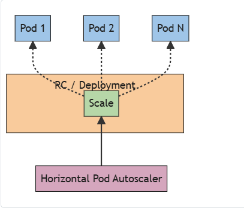

# 네임스페이스~ 오토스케일링

> 한줄평 :
> 

# Kubernetes

하위 문서 정리

https://kubernetes.io/ko/docs/concepts/overview/working-with-objects/namespaces/

https://kubernetes.io/ko/docs/tasks/run-application/horizontal-pod-autoscale/

배경 

# Namespace

> 단일 클러스터 내에서 제공되는 리소스 그룹 격리 메커니즘
네임스페이스 내의 리소스 이름은 unique 해야하며, 네임스페이스간에는 겹쳐도 된다
scoping은 네임스페이스 기반 오브젝트( 디플로이먼트 , 서비스 등) 에만 적용되며, 클러스터 범위 오브젝트(스토리지 클래스, 노드, 퍼시스턴트 볼륨 등) 에는 적용 불가능하다
> 

## 여러 개의 네임스페이스를 사용하는 경우

배경 

- 여러 팀이나 프로젝트에 걸쳐 많은 사용자가 있는 환경에서 사용하도록 만들어짐
- 사용자가 적은(수십명 이내) 경우는 전혀  고려할 필요 없다 ,,,(다만 네임스페이스가 제공하는 기능이 필요할때만 고려해보도록 하자..)

> 프로덕션 클러스터
dafault 네임스페이스를 사용하지 않도록 한다.
> 

## 초기 네임스페이스

- default
- kube-node-lease : 각 노드와 연관된 Lease 오브젝트 소유( Lease : kubelet이 heartbeat를 보내 Control plane이 노드 장애를 탐지 할 수 있게함 )
- kube-public : 모든 클라이언트가 읽기 권한으로 접근 가능 (공개 리소스를 위해 예약됨)- 관례상그렇게 쓴다~
- kube-system : kubernetes system이 생성한 오브젝트를 위한 네임스페이스

<aside>
💡

Lease
일정 주기로 갱신되는 타임스탬프 기반 리소스 , 

특정 컴포넌트가 살아있음을 나타냄 

</aside>

## 네임스페이스 다루기

## 조회

```yaml
kubectl get namespace
```

## 설정

--namespace 플래그 사용

```
kubectl run nginx --image=nginx --namespace=<insert-namespace-name-here>
kubectl get pods --namespace=<insert-namespace-name-here>
```

### 선호 네임스페이스 설정하기

```
kubectl config set-context --current --namespace=<insert-namespace-name-here>
# 확인하기
kubectl config view --minify | grep namespace:
```

### 네임스페이스 와 DNS

1. 서비스 DNS 도메인 구성
    - 서비스 생성 시 자동으로 DNS 엔트리가 생성됨
    
    <서비스이름>.<네임스페이스이름>.svc.cluster.local
    
    - <서비스이름> 만 사용하면 자신과 같은 네임스페이스의 서비스에 연결됨
    - 네임스페이스별로 같은 서비스 이름을 써도 충돌 없이 분리 운영 가능 good
2. FqDN 이 필요한 경우 
    - **다른 네임스페이스의 서비스**에 접근하려면 **FQDN (Fully Qualified Domain Name)** 사용 필요
    - my-service.dev.svc.cluster.local

> ⚠️ 공개 최상위 도메인 과 네임스페이스가 동일 이름이면 위험
공개 DNS 보다 내부 DNS 가 우선됨 
방지법 : 어드미션 웹훅을 이용하여 공개 TLD와 동일 이름의 네임스페이스 명 자동 차단 가능
> 

### 네임스페이스에 속하지 않는 리소스

- 대부분의 리소스는 네임스페이스에 속함:
    - 예: Pod, Service, Deployment 등
- 하지만 일부 리소스는 **네임스페이스에 속하지 않음**:
    - 예: Node, PersistentVolume, Namespace 리소스 자체 등

```
# 네임스페이스에 속하는 리소스
kubectl api-resources --namespaced=true

# 네임스페이스에 속하지 않는 리소스
kubectl api-resources --namespaced=false
```

## 자동 레이블링

- `NamespaceDefaultLabelName`  필드를 활성화 한 경우 , immutable 레이블  을  모든 네임스페이스에 설정한다.
- 이때 레이블 값은 네임스페이스 이름이 된다.

## **Horizontal Pod Autoscaling**

> 수평 스케일링은 부하 증가에 대해 [파드](https://kubernetes.io/ko/docs/concepts/workloads/pods/)를 더 배치하는 것

HPA: **파드의 CPU 사용량이나 사용자 정의 메트릭**을 기준으로 **파드 수를 자동 조절**하는 컨트롤러
> 

### **HorizontalPodAutoscaler는 어떻게 작동하는가?**



조건 

- 클러스터에 **Metrics Server**가 설치되어 있어야 함
- 대상 리소스는 **Deployment,StatefulSet,**  **ReplicaSet** 등

**작동 흐름 (컨트롤 루프)**

> 15초마다(기본값) 주기적으로 실행되는 비지속적인 컨트롤 루프 형태로 작동
> 
1. `kube-controller-manager`가 주기적으로 실행됨
    
    (옵션: `--horizontal-pod-autoscaler-sync-period`, 기본: 15초)
    
2. 각 HPA 정의를 확인하고:
    - `.spec.scaleTargetRef`로 대상 워크로드 조회
    - `.spec.selector`로 대상 파드 선택
3. **메트릭 조회**
    - 파드 단위 메트릭: `metrics.k8s.io`
    - 커스텀 메트릭: `custom.metrics.k8s.io`
    - 외부 메트릭: `external.metrics.k8s.io`

스케일 결정 방식

- 기준: **CPU, 메모리, 커스텀 메트릭, 외부 메트릭 등**

알고리즘 
`원하는 레플리카 수 = ceil[현재 레플리카 수 * ( 현재 메트릭 값 / 원하는 메트릭 값 )]`

- 현재 메트릭이 200m 이고 , 원하는 값이 100인 경우 2.0 이므로 복제본 수가 두배가 된다.
- 현재 메트릭이 30m이면 0.5이므로, 복제본 수가 절반이 된다.

주의 사항

| 항목 | 설명 |
| --- | --- |
| 컨테이너 리소스 요청 미설정 시 | CPU 사용률 계산 불가 → HPA는 무시함 |
| Metrics Server 필수 | `metrics.k8s.io` API 제공용 애드온. **직접 설치 필요** |
| Scale 서브리소스 사용 | Deployment 등은 `.scale` 서브리소스를 통해 동적으로 파드 수 조절됨 |

## 워크로드 스케일링의 안정성

HorizontalPodAutoscaler 로 Replicat 그룹의 크기를 관리할때, 측정하는 메트릭의 동적 특성에 따라 레플리카 수가 자주 요동 칠 수 있다 . ⇒ thrashing or flapping

## 롤링 업데이트 중 오토 스케일링

| 항목 | Deployment | StatefulSet |
| --- | --- | --- |
| 롤링 업데이트 | ReplicaSet을 통해 새 Replicaset으로 병렬적 교체 | 파드를 하나씩 순차적으로 교체 |
| HPA 적용 방식 | `.spec.replicas` 수정 → ReplicaSet에 반영 | `.spec.replicas` 직접 수정 |
| 스케일 구조 | 3단 구조 (HPA → Deployment → ReplicaSet) | 2단 구조 (HPA → StatefulSet) |
| 동시성 | 고성능, 병렬 스케일링 가능 | 느림, 순차성 보장 |